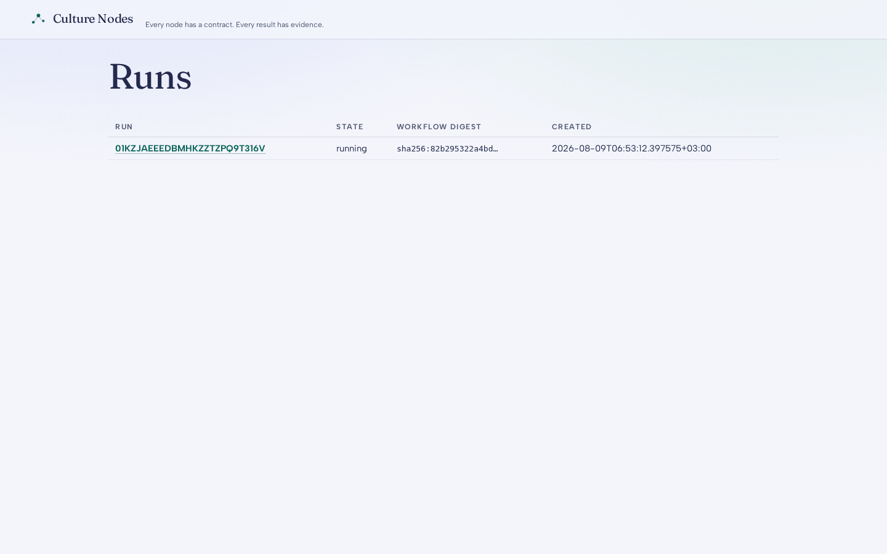
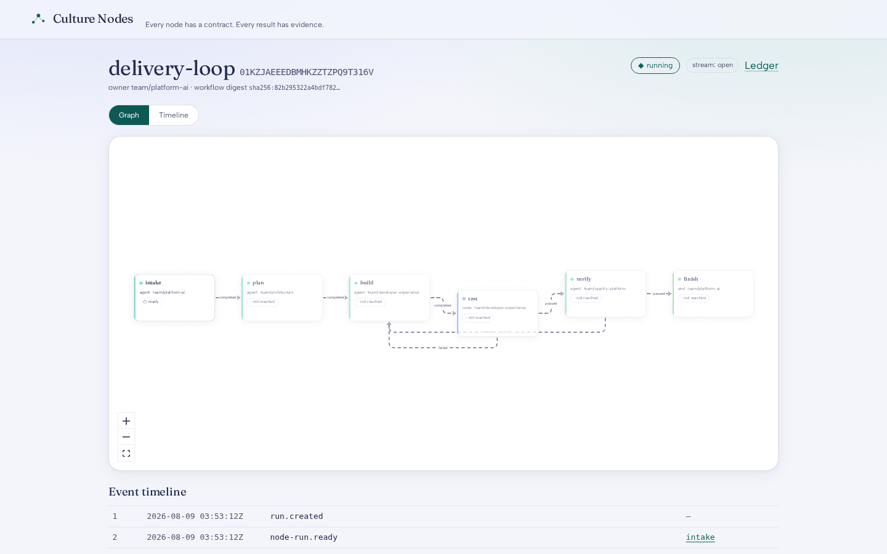
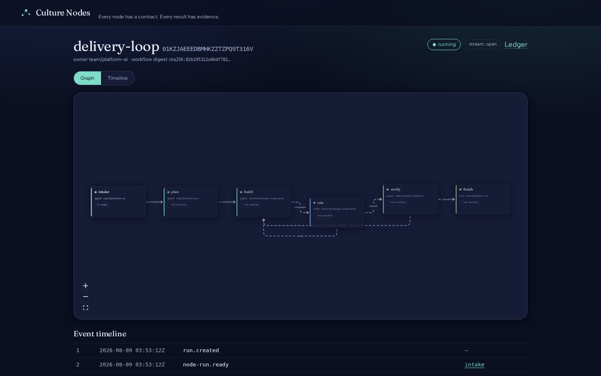
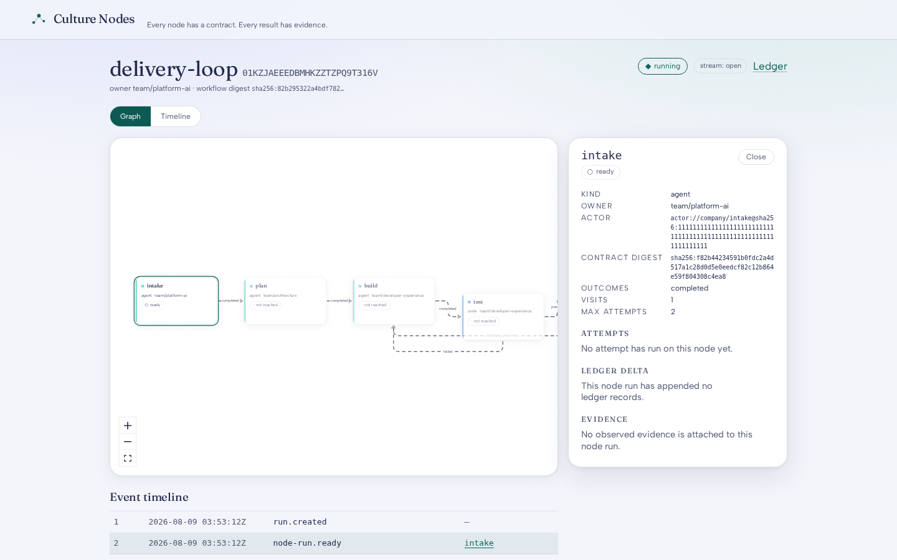
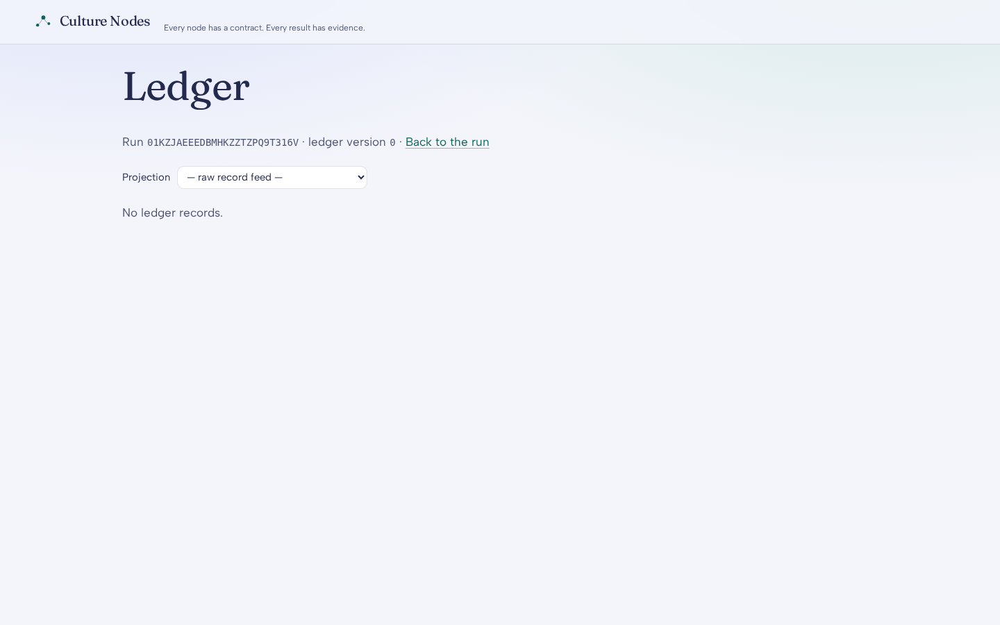

# Culture Nodes — setup and tour

The shortest honest path from `git clone` to watching a workflow run, and
what each screen is telling you once it does.

> **Every node has a contract. Every result has evidence.**

## 1. Run it

### Docker Compose (the one-command path)

Everything local: API + scheduler + worker + PostgreSQL + MinIO, with the
web UI embedded in the same binary.

```bash
cd deploy/compose
cp .env.example .env       # required: the compose file ships no password literals
docker compose up --build
```

Open <http://localhost:8080> — the UI is served by the control plane itself
(no separate frontend container). `POST`-able API lives under
`/v1alpha1`; `GET /v1alpha1/healthz` says `{"status":"ok"}` when it's up.

### Kubernetes (Helm)

```bash
helm install nodes deploy/helm/culture-nodes
```

The chart deploys per-role Deployments (api / scheduler / worker) of one
image, applies migrations via a pre-install Job, defaults the worker to
`replicas: 2` — safe by construction: leases, fencing tokens, and
`SKIP LOCKED` claiming mean identical pods never double-work — and exposes
the API (which is also the actor-callback surface) through an optional
Ingress.

> **Trust boundary:** Phase 1 runs **authless behind a private network**.
> Anyone with network reach has full control. Private cluster/VPC only;
> OIDC lands in Phase 2.

### Dev mode (no containers)

```bash
export NODES_DATABASE_URL=postgres://...   # any Postgres 15+
go run ./cmd/nodes migrate
go run ./cmd/nodes all                     # serve + scheduler + worker in one process
```

## 2. Give it work

Publish the reference workflow (the PRD's delivery loop: intake → plan →
build → test → verify, with `test.failed` and `verify.changes_required`
looping back to build) and create a run:

```bash
export NODES_API_URL=http://localhost:8080
uv run nodes workflow publish examples/delivery-loop/workflow.yaml
# → digest: sha256:…  (immutable, content-addressed; runs pin it forever)

uv run nodes run create --workflow sha256:… --input examples/delivery-loop/input.json
uv run nodes run events <run-id>           # live SSE stream, one line per committed event
```

Agent nodes need an actor to talk to: an external process — on another
machine or container, never inside culture-nodes — speaking the actor
protocol. Register its endpoint in the `actors` table and the worker
dispatches to it; the actor's `origin.actor_id` must be its *registered*
actor row id. Code nodes go through the runner boundary: AWS Lambda in the
cloud, an in-process headspace-cli bridge under a heartbeated lease, or a
separate runner service reachable over the runner protocol (`cmd/nodes-runner`
or your own) that the worker dispatches to and polls for completion. See the
next section for what "register an actor/runner" means concretely, and for
plugging in something other than the shipped references.

## 3. Bring your own actor or runner

Nothing above requires the reference implementations this repo ships —
they exist to prove the two contracts against real backends and to give the
next implementer working code to read, not because they are the only valid
option. There is no actor/runner *registration* HTTP endpoint yet (PRD §26
open question), so today "register" means one row in a table:

- **Actor** (`api/actor-protocol/README.md`): insert a row in the `actors`
  table naming your process's base URL, then point a workflow node's
  `uses:` at it. `adapters/colleague`, `adapters/claude-code`, and
  `adapters/codex` are three conformant references (contract-v1 subprocess
  dispatch over `colleague work`, headless `claude -p`, and `codex exec`
  respectively — each with its own README covering config); a fourth, in
  any language, is exactly as valid once it passes `tests/conformance`
  unmodified.
- **Runner** (`api/runner-protocol/README.md`): register a `ServiceIdentity`
  (endpoint + pinned image digest + `secret_ref`) in
  `internal/runners.FunctionRegistry`. The protocol is deliberately small —
  `POST /v1/operations` to dispatch, `GET /v1/operations/{id}` to learn the
  outcome, async-only (a `202` and the connection closes; the runtime learns
  completion by polling, never by holding a connection open), an optional
  completion callback that only tightens latency, and mandatory bearer auth
  with no loopback exemption. `cmd/nodes-runner` (wrapping headspace-cli) is
  the reference; anything that passes `tests/runnerconformance` unmodified
  is a conformant replacement, in any language.

Because placement is a registry fact and not a workflow property, moving a
`code` node's execution from one runner to another — including across
machines — is a config change, never a workflow edit. See "Beyond one
machine" below for what that buys in practice.

## 4. Beyond one machine

The placement-unaware property above is what makes a production split
possible with zero workflow changes. As one example (not a product
requirement — any machine names, any count, any cloud or bare metal work
the same way): local dev runs everything on one machine (`spark` in this
repo's own case); a small production split runs the shared control plane
and its Postgres on one machine (`thor`), and a second machine (`orin`)
runs just a worker plus its own runner service, both pointed at `thor`'s
database. The runner-protocol doc's own worked example is exactly this
shape (`runner.thor.internal` as an endpoint). Per-machine compose profiles
for this split are landing later in this repo's own development cycle —
today's `deploy/compose` ships the single-machine profile from step 1.

## 5. What you're looking at



`/runs` — every run, each pinned to an immutable workflow digest; nothing
here ever resolves "latest".



`/runs/:id` — the run as a live graph: solid edges have been walked, dashed
edges are still possibilities, and the loop edges back to `build` are
declared domain outcomes, not failures.



Dark mode follows `prefers-color-scheme`, using the design tokens pinned
from the AgentCulture project (`web/src/culture-design/`, ADR 0001).



Click a node (or Tab to it and press Enter — the canvas is fully
keyboard-operable): its contract digest, owner, every attempt with fencing
token, and the ledger records that attempt appended.



The work ledger is the run's meaning: agents can only *propose* (dashed
chip), humans confirm, trusted runners observe what they measured,
validators derive — so a completion claim that nothing verified stays
visibly unverified.

<!-- placeholder: assets/board.png — runs board, cards on state columns — landing this cycle -->
<!-- placeholder: assets/jobs-timeline.png — cross-run jobs timeline + time-range filter — landing this cycle -->

`/runs` today is the whole operations surface: a **runs board** (cards
grouped into state columns) and a **jobs timeline** (cross-run node-run
history with a time-range filter) are landing later this cycle — this
section grows two more screenshots once they ship.

## 6. Approvals: a human in the loop

An `approval` node pauses a run without ever creating a work item for the
worker to claim: the engine writes one `human_tasks` row — decision schema,
approver role/group, deadline, context/artifact refs, allowed outcomes
(PRD §9.9) — inside the same transaction that creates the node run, and the
paused run holds no worker lease and no open database transaction while it
waits. A human answers through the API, never through the worker:

```bash
curl http://localhost:8080/v1alpha1/human-tasks               # pending + decided
curl http://localhost:8080/v1alpha1/human-tasks/<id>           # one task's context

curl -X POST http://localhost:8080/v1alpha1/human-tasks/<id>/decision \
  -H "Authorization: Bearer $NODES_HUMAN_DECISION_TOKEN_SECRET" \
  -H 'content-type: application/json' \
  -d '{"outcome": "approved", "decider_actor_id": "ori", "expected_ledger_version": 4}'
```

Unlike the rest of this authless-behind-a-private-network API, the decision
endpoint requires a bearer token (`NODES_HUMAN_DECISION_TOKEN_SECRET` on
`nodes serve`) — a decision writes a human-authority review into the ledger
and resumes the run, so it is the one write here that must know who is
making it. The commit is atomic and stale-guarded: a decision against a
ledger version the run has since moved past is refused. The shipped
[`examples/delivery-loop`](../examples/delivery-loop) workflow does not
include an approval node yet (see its header comment) — add one to a
workflow of your own to exercise this path; the engine, API, and worker
plumbing above are real and tested independently of that fixture.

## 7. Poke at it from the CLI

Everything the UI renders is the same API the CLI fronts:

```bash
uv run nodes run get <run-id>                      # run + tokens + node runs + attempts
uv run nodes ledger records <run-id>               # the append-only record stream
uv run nodes ledger projection <run-id> ready_tasks
uv run nodes review create <run-id> --records id1,id2 --ledger-version N
uv run nodes review commit <review-id> --confirm id1 --ledger-version N
```

Add `--json` to any verb for the raw API payload, byte-exact.

## 8. Tear it down

```bash
docker compose down -v        # compose profile
helm uninstall nodes          # k8s
```

## Going deeper

- [`docs/initial-design/culture-nodes-prd-spec.md`](initial-design/culture-nodes-prd-spec.md) — the full PRD.
- [`docs/acceptance.md`](acceptance.md) — the Phase-1 checklist mapped to test evidence.
- [`docs/benchmarks.md`](benchmarks.md) — recorded idle-memory and throughput numbers.
- [`docs/adr/`](adr/) — the design decisions, including the pinned org design revision and the Lambda IAM model.
- [`api/actor-protocol/README.md`](../api/actor-protocol/README.md) — the full actor-protocol wire contract.
- [`api/runner-protocol/README.md`](../api/runner-protocol/README.md) — the full runner-protocol wire contract.
- [`adapters/colleague/README.md`](../adapters/colleague/README.md),
  [`adapters/claude-code/README.md`](../adapters/claude-code/README.md),
  [`adapters/codex/README.md`](../adapters/codex/README.md) — running a real
  external agent against a workflow, one per backend.
- [`deploy/compose/README.md`](../deploy/compose/README.md) — the local compose profile in full, including the code-runner boundary and the `agents` profile.
